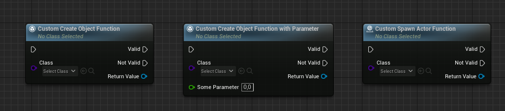
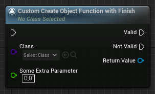

#  Neat Functions
Unreal Engine plugin that adds some new metadata tags you can put on `UFUNCTION`s to get a better user experience when the functions are used in Blueprint.
Currently it supports two types of extensions:
- `NeatDelegateFunction`: Adds the ability to create AsyncAction-like delegates on regular functions.
- `NeatConstructor`: Makes functions that constructs `UObject`s work like the builtin `SpawnActorByClass` node; i.e. supporting the `ExposeOnSpawn` metadata tag.

## Examples - Delegates

### Simple
This is a simple example of what this plugin does, with the code used to create the nodes below. The `Original function` to the left is what Unreal typically generates without this plugin. The `Neat function` to the right is what this plugin generates.


```c++
DECLARE_DYNAMIC_DELEGATE(FMyDelegate);

UFUNCTION(BlueprintCallable, meta = (NeatDelegateFunction))
void MyFunction(FMyDelegate Delegate)
{
	Delegate.ExecuteIfBound();
}
```

### Parameters
More complex delegate types are supported, so you can also use delegates with parameters. Those parameters will also show up on the node.


```c++
DECLARE_DYNAMIC_DELEGATE_TwoParams(FMyDelegateParams, float, FloatValue, int32, IntValue);

UFUNCTION(BlueprintCallable, meta = (NeatDelegateFunction))
void MyFunctionWithParams(FMyDelegateParams Delegate)
{
    Delegate.ExecuteIfBound(42.0f, 42);
}
```

### Multiple delegates
You can even use _different_ delegate types with different parameters on the same function, unlike async actions.


```c++
DECLARE_DYNAMIC_DELEGATE(FMyDelegate);
DECLARE_DYNAMIC_DELEGATE_TwoParams(FMyDelegateParams, float, FloatValue, int32, IntValue);

UFUNCTION(BlueprintCallable, meta = (NeatDelegateFunction))
void MyFunctionMultipleDelegates(FMyDelegate Delegate, FMyDelegateParams DelegateParams)
{
    Delegate.ExecuteIfBound();
    DelegateParams.ExecuteIfBound(42.0f, 42);
}
```

## Examples - Constructor

### Simple
The `NeatConstructor` metadata tag allows you to write actor-, component- or any other object constructor functions that can expose `ExposeOnSpawn` pins.
This works (in the case of actors), by deferring `BeginPlay` until later. The `NeatConstructor` node will call your function, set any exposed properties on the spawned object, then call `FinishSpawning` on it, calling `BeginPlay`.
For `UObject`s, this is not the case, since they don't have the concept of `BeginPlay`, so they will not call `FinishSpawning`.


```c++
// This works with UObject subclasses.
UFUNCTION(BlueprintCallable, meta = (NeatConstructor))
static UObject* CustomCreateObjectFunction(TSubclassOf<UObject> Class)
{
    // ...
}

// This also works with actor subclasses.
UFUNCTION(BlueprintCallable, meta = (NeatConstructor, WorldContext = "WorldContextObject"))
static AActor* CustomSpawnActorFunction(UObject* WorldContextObject, TSubclassOf<AActor> Class)
{
    // ...
}

// You can also pass any parameters you need to the function.
UFUNCTION(BlueprintCallable, meta = (NeatConstructor))
static UObject* CustomCreateObjectFunctionWithParameter(TSubclassOf<UObject> Class, float SomeParameter)
{
    // ...
}
```

### With custom finish function
In some cases (for a custom `UObject` subclass perhaps), you may want to call a custom "finish" function. This means the execution of the node is the following:
1. Call the spawn function.
2. Set all `ExposeOnSpawn` properties.
3. Call the finish function.

> [!NOTE]
> For any `AActor` subclass, we automatically insert a default `FinishSpawning` node when using the `NeatConstructor` metadata. By using `NeatConstructorFinish`, you can override which function gets called for actors too.


```c++
// We define our function and specify which "finish" function to use.
UFUNCTION(BlueprintCallable, meta = (NeatConstructorFinish = "CustomCreateObjectFunctionWithFinish_Finish"))
static UObject* CustomCreateObjectFunctionWithFinish(TSubclassOf<UObject> Class)
{
    // ...
}

// The first parameter that matches the class of the spawner function will be assigned the spawned object.
// Note that you can also pass any parameters that are required for the finish function.
UFUNCTION(BlueprintCallable, meta = (BlueprintInternalUseOnly = true))
static void CustomCreateObjectFunctionWithFinish_Finish(UObject* Object, float SomeExtraParameter)
{
    // ...
}
```
