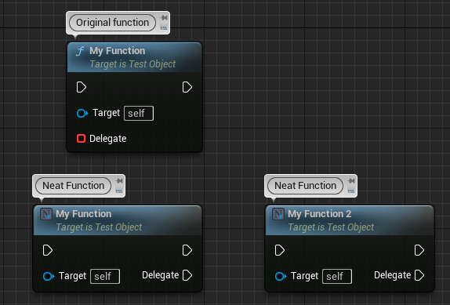
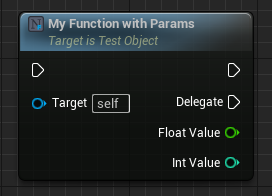
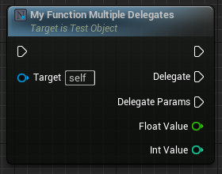

#  Neat Functions
Unreal Engine plugin that extends UFunctions in some neat ways. Functions that take delegates can have their events created in the function node itself, making them look like async actions.

## Examples - Delegates

### Simple
This is a simple example of what this plugin does, with the code used to create the nodes below. The `Original function` to the left is what Unreal typically generates without this plugin. The `Neat function` to the right is what this plugin generates.


```c++
DECLARE_DYNAMIC_DELEGATE(FMyDelegate);

UFUNCTION(BlueprintCallable, meta = (NeatDelegateFunction))
void MyFunction(FMyDelegate Delegate)
{
	Delegate.ExecuteIfBound();
}
```

### Parameters
More complex delegate types are supported, so you can also use delegates with parameters. Those parameters will also show up on the node.


```c++
DECLARE_DYNAMIC_DELEGATE_TwoParams(FMyDelegateParams, float, FloatValue, int32, IntValue);

UFUNCTION(BlueprintCallable, meta = (NeatDelegateFunction))
void MyFunctionWithParams(FMyDelegateParams Delegate)
{
    Delegate.ExecuteIfBound(42.0f, 42);
}
```

### Multiple delegates
You can even use _different_ delegate types with different parameters on the same function, unlike async actions.


```c++
DECLARE_DYNAMIC_DELEGATE(FMyDelegate);
DECLARE_DYNAMIC_DELEGATE_TwoParams(FMyDelegateParams, float, FloatValue, int32, IntValue);

UFUNCTION(BlueprintCallable, meta = (NeatDelegateFunction))
void MyFunctionMultipleDelegates(FMyDelegate Delegate, FMyDelegateParams DelegateParams)
{
    Delegate.ExecuteIfBound();
    DelegateParams.ExecuteIfBound(42.0f, 42);
}
```

## Examples - Constructor

### Simple
The Neat Constructor metadata tag allows you to write actor-, component- or any other object constructor functions that can expose ExposeOnSpawn pins.
This works (in the case of actors), by deferring BeginPlay until later. The NeatConstructor node will call your function, set any exposed properties on the spawned object, then call `FinishSpawning` on it, calling `BeginPlay`.
For `UObject`s, this is not the case, since they don't have the concept of `BeginPlay`, so they will not call `FinishSpawning`.
```c++
// This works with UObject subclasses
UFUNCTION(BlueprintCallable, meta = (NeatConstructor))
static UObject* CustomCreateObjectFunction(TSubclassOf<UObject> Class)
{
    // ...
}

// This also works with actor subclasses
UFUNCTION(BlueprintCallable, meta = (WorldContext = "WorldContextObject", NeatConstructor))
static AActor* CustomSpawnActorFunction(UObject* WorldContextObject, TSubclassOf<AActor> Class)
{
    // ...
}

// You can also pass any parameters you need to the function.
UFUNCTION(BlueprintCallable, meta = (NeatConstructor))
static UObject* CustomCreateObjectFunction(TSubclassOf<UObject> Class, float SomeParameter)
{
    // ...
}
```

### With Finish
In some cases (for a custom `UObject` subclass perhaps), you may want to call a custom "finish" function. In that case you may specify it like this:
```c++
// We define our function, but specify which "finish" function to use.
UFUNCTION(BlueprintCallable, meta = (NeatConstructorFinish = "CustomCreateObjectFunction_Finish"))
static UObject* CustomCreateObjectFunction(TSubclassOf<UObject> Class)
{
    // ...
}

// The first parameter that matches the class of the spawner function will be passed the spawned object.
// Note that you can also pass any parameters that are required for the finish function. They will show up on the node.
UFUNCTION(BlueprintCallable, meta = (BlueprintInternalUseOnly = true))
static void CustomCreateObjectFunction_Finish(UObject* Object, float SomeExtraParameter)
{
    // ...
}
```