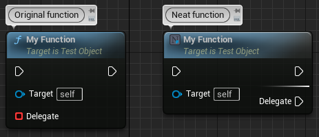
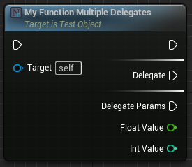

#  Neat Functions
Unreal Engine plugin that extends UFunctions in some neat ways. Functions that take delegates can have their events created in the function node itself, making them look like async actions.

## Examples

### Simple
This is a simple example of what this plugin does, with the code used to create the nodes below. The `Original function` to the left is what Unreal typically generates without this plugin. The `Neat function` to the right is what this plugin generates.


```c++
DECLARE_DYNAMIC_DELEGATE(FMyDelegate);

UFUNCTION(BlueprintCallable, meta = (NeatDelegateFunction))
void MyFunction(FMyDelegate Delegate)
{
	Delegate.ExecuteIfBound();
}
```

### Parameters
More complex delegate types are supported, so you can also use delegates with parameters. Those parameters will also show up on the node.


```c++
DECLARE_DYNAMIC_DELEGATE_TwoParams(FMyDelegateParams, float, FloatValue, int32, IntValue);

UFUNCTION(BlueprintCallable, meta = (NeatDelegateFunction))
void MyFunctionWithParams(FMyDelegateParams Delegate)
{
    Delegate.ExecuteIfBound(42.0f, 42);
}
```

### Multiple delegates
You can even use _different_ delegate types with different parameters on the same function, unlike async actions.


```c++
DECLARE_DYNAMIC_DELEGATE(FMyDelegate);
DECLARE_DYNAMIC_DELEGATE_TwoParams(FMyDelegateParams, float, FloatValue, int32, IntValue);

UFUNCTION(BlueprintCallable, meta = (NeatDelegateFunction))
void MyFunctionMultipleDelegates(FMyDelegate Delegate, FMyDelegateParams DelegateParams)
{
    Delegate.ExecuteIfBound();
    DelegateParams.ExecuteIfBound(42.0f, 42);
}
```
